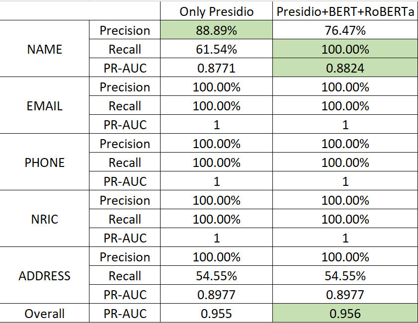

# PII-Detection-Redaction-API

## **I. Introduction**
This project implements a **Personal Identifiable Information (PII) Detection & Redaction API** that accurately detects and redacts sensitive information, such as:
-  **Names**
-  **Emails**
-  **Phone Numbers**
-  **NRIC (Singapore ID)**
-  **Addresses**

This system integrates **multiple AI models** to achieve **high accuracy, recall, and precision**:
- **Presidio (Rule-Based NLP Model)**
- **BERT (State-of-the-Art Contextual Model)**
- **RoBERTa (Optimized for NER Tasks)**

---

## **II. Algorithm Design**

### - **Building the Baseline: Presidio**

I began by researching PII detection and, after studying various options, decided to use **Presidio** to build and test an initial algorithm. While Presidio is an older library and no longer the SOTA solution, it is small, efficient, and fast, making it an ideal choice for quickly getting familiar with the task and setting up a **baseline**.

However, I soon discovered a major limitation: Presidio, as a general-purpose library, struggled with recognizing Singapore-specific PII data. After carefully analyzing the raw data, I gradually added **customized constraints** for different types of information to improve detection accuracy. With these refinements, Presidio reached a reasonably strong performance level.

Once I had a usable baseline, I conducted a **bad case analysis** and found a critical flaw: Presidio does not understand context. Instead, it relies solely on individual data patterns to identify PII. However, in the raw data, there is a significant amount of contextual information that could be leveraged for better recognition.
For example:

> My name is xx [name]. I stay at xx [address]. Please contact me at xx [phone].

Such context provides strong clues about the type of PII present, but Presidio fails to utilize it.

### - **Enhancing Contextual Understanding: BERT & RoBERTa**

To address this limitation, I turned to **Hugging Face** in search of more powerful, context-aware SOTA models. After comparing multiple options, I selected **BERT and RoBERTa**, as both are known for their strong contextual understanding and should theoretically improve PII recognition.

### - **Merging Results for Optimal Performance**

Initially, I experimented with a voting-based fusion approach, combining results from all three models (Presidio, BERT, and RoBERTa). However, this approach did not work well because BERT and RoBERTa are end-to-end models and lack the flexibility to incorporate local constraints—a key factor that made Presidio effective. As a result, these models often failed on location, phone numbers, and other region-specific PII, performing well only in name detection.

After extensive testing, I found the best-performing approach was:
- Using all three models (Presidio, BERT, RoBERTa) for "NAME" detection (majority voting)
- Relying solely on Presidio for all other PII categories

This hybrid method leverages Presidio’s rule-based accuracy for structured information while benefiting from BERT and RoBERTa’s contextual understanding where it is most effective.

---

## **III. Evaluation**

### - Test Data
To evaluate the performance of my algorithm, I manually labeled the first 20 raw data entries with PII annotations to serve as a test dataset. This ensures that the evaluation reflects real-world PII detection challenges.

### - Evaluation Metrics: Precision, Recall, PR-AUC

For PII detection, minimizing False Negatives (FN) is the top priority, because failing to detect a PII instance poses a greater risk than incorrectly classifying a non-PII word as sensitive information.

Similar to LionGuard, the evaluation metric here uses **PR-AUC** instead of F1-Score.**PR-AUC** provides a more comprehensive view of model performance across different confidence thresholds, making it better suited for imbalanced PII detection tasks where missing a PII entity is much more costly than detecting a few extra false positives.

---

## **IV. Results**

---

## **V. Models**

1. **Rule-based models (Presidio)** are highly controllable but **lack contextual understanding**.
2. **Contextual models (BERT/RoBERTa)** are **powerful in context-based recognition** but may suffer from false positives.
3. **Singapore-specific data characteristics** require **customized rule enhancements**.

| **Model**    | **Strengths** | **Weaknesses** | **How We Use It** |
|-------------|--------------|---------------|----------------|
| **Presidio** |  Customizable, rule-based accuracy |  Lacks contextual understanding | **Primary detection model** with Singapore-specific constraints |
| **BERT** |  Strong in contextual PII recognition |  Some false positives | **Used only for missing PII in Presidio** |
| **RoBERTa** |  More optimized than BERT for NER |  Requires more compute | **Further refines Name detection** |

 

---
## **VI. Future Plans**

- **Expanding and Improving Test Data**: Increase the size and diversity of the test dataset by labeling more real-world PII examples. Add more edge cases.
- **Enhancing PII Redaction Validation**: Develop an automated validation framework to check if redacted outputs correctly cover all sensitive information.
- **Fine-Tuning Models with Localized Data**: Fine-tune BERT/RoBERTa on Singapore-specific PII patterns, including local names, addresses, and phone numbers.
- **Optimizing Performance with More Compute Power**
